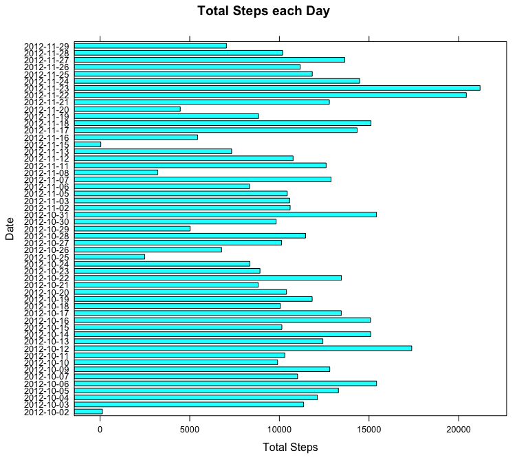

# Reproducible Research: Peer Assessment 1
The main thing that you have to remember on this journey is, just be nice to everyone and always smile.  


## Loading and preprocessing the data

1. Show any code that is needed to Load the data (i.e. read.csv())


```r
## 1.
file <-  "activity.zip"
##unzip
data <- read.csv(unz(file, "activity.csv"))

```

2. Process/transform the data (if necessary) into a format suitable for your analysis


```r
## 2. transform for easier processing
data$steps <- as.numeric(data$steps)
data$interval <- as.numeric(data$interval)
data$date <- as.Date(data$date)
```
## dataframe the way we want it

```r
total.steps.daily <- aggregate(steps ~ date, data=data, sum, na.rm=TRUE)
```
##2b. Also install needed tools

```r
library(latticeExtra)
```

```
## Loading required package: RColorBrewer
## Loading required package: lattice
```

```r
library(lattice)
```

## What is mean total number of steps taken per day?

1.Make a histogram of the total number of steps taken each day

The histogram looks like this:

```r
hist(total.steps.daily$steps)
```

 


But I think this chart shoes better the daily steps:

```r
barchart(total.steps.daily$date ~ total.steps.daily$steps,
         main = "Total Steps each Day", 
         xlab = "Total Steps", ylab = "Date",
         par.strip.text = list(cex = 5),)
```

 


2.Calculate and report the mean and median total number of steps taken per day


```r
mean(total.steps.daily$steps)
```

```
## [1] 10766.19
```

```r
median(total.steps.daily$steps)
```

```
## [1] 10765
```


## What is the average daily activity pattern?

1. Make a time series plot (i.e. type = "l") of the 5-minute interval (x-axis) and the average number of steps taken, averaged across all days (y-axis)

2. Which 5-minute interval, on average across all the days in the dataset, contains the maximum number of steps?


```r
average.steps.per.interval <- aggregate(steps ~ interval, data, mean)
plot(average.steps.per.interval, type = "l", main = "Average daily activity pattern")
```

 


2. Which 5-minute interval, on average across all the days in the dataset, contains the maximum number of steps?


```r
subset(average.steps.per.interval, steps == max(steps))
```

```
##     interval    steps
## 104      835 206.1698
```

```r
max.interval <- subset(average.steps.per.interval, steps == max(steps))
plot(average.steps.per.interval, type = "l", main = "Average daily activity pattern")
abline(v = max.interval$interval, col = "green", lwd = 1)
axis(1, at=max.interval$interval,labels=max.interval$interval, col="green")
```

 

## Imputing missing values

1. Calculate and report the total number of missing values in the dataset (i.e. the total number of rows with NAs)


```r
sum(is.na(data))
```

```
## [1] 2304
```


2. Devise a strategy for filling in all of the missing values in the dataset. The strategy does not need to be sophisticated. For example, you could use the mean/median for that day, or the mean for that 5-minute interval, etc.

I chose the mean for intervals:


```r
new.data <- merge(data, average.steps.per.interval, by = "interval", suffixes = c("", ".new"))
na.steps <- is.na(new.data$steps)
new.data$steps[na.steps] <- new.data$steps.new[na.steps]
```

3. Create a new dataset that is equal to the original dataset but with the missing data filled in.

```r
no.na.data <- new.data[, c(1:3)]
```


4a.Make a histogram of the total number of steps taken each day 

The following chart overlays the two sets of data in order to get a clearer idea of the impact of modifying the first data set.
Note that some days where completely missing from the origianal set, while some others completely overlap in the two sets.

Original set in colored green, new set colored red.*


```r
total.steps.daily.no.na.data <- aggregate(steps ~ date, data=no.na.data, sum)
## overlapping the two charts
new.barchart <- barchart(total.steps.daily.no.na.data$date ~ total.steps.daily.no.na.data$steps, 
                          main = "Total Steps each Day/ overlay of the two datasets", 
                         xlab = "Total Steps", ylab = "", col="red")
original.barchart <- barchart(total.steps.daily$date ~ total.steps.daily$steps, 
                              main = "Total Steps each Day", 
                              xlab = "Total Steps", ylab = "", col="green"
                              )

doubleYScale(new.barchart, original.barchart)
```

 

4b Calculate and report the mean and median total number of steps taken per day.


```r
mean(total.steps.daily.no.na.data$steps)
```

```
## [1] 10766.19
```


```r
median(total.steps.daily.no.na.data$steps)
```

```
## [1] 10766.19
```


4c Do these values differ from the estimates from the first part of the assignment? What is the impact of imputing missing data on the estimates of the total daily number of steps?

Because of the way we've mofidied the NA values, median and the mean coincide so while adding a significant amount to the total steps, the averages are follow the initial patterm.


## Are there differences in activity patterns between weekdays and weekends?

1. Create a new factor variable in the dataset with two levels – “weekday” and “weekend” indicating whether a given date is a weekday or weekend day.


```r
## I created the weekend.var variable
no.na.data$week <- weekdays(no.na.data$date)
no.na.data$weekend.var <- no.na.data$week=="Sunday" | no.na.data$week=="Saturday"
no.na.data$weekend.var[no.na.data$weekend.var==TRUE] <- "weekend"
no.na.data$weekend.var[no.na.data$weekend.var==FALSE] <- "weekday"
no.na.data$weekend.var <- as.factor(no.na.data$weekend.var)
```

2. Make a panel plot containing a time series plot (i.e. type = "l") of the 5-minute interval (x-axis) and the average number of steps taken, averaged across all weekday days or weekend days (y-axis). See the README file in the GitHub repository to see an example of what this plot should look like using simulated data.


```r
no.na.data.day.type <- aggregate(data=no.na.data, steps ~ weekend.var + interval, mean)

##Here I followed the type that was fiven in the README file example

xyplot(data=no.na.data.day.type, steps ~ interval | weekend.var, type="l",
  xlab="Interval",
  ylab="Number of steps",
  layout=c(1,2)
)
```

 
